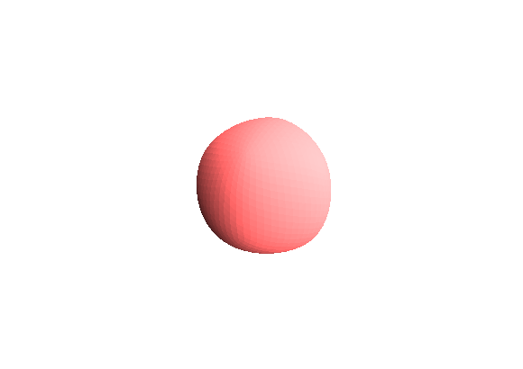

# Subdivision surface
Project for Computer Graphics course.

### Summary
This project is about applying subdivision algorithm to a cube.  
I used a Lomont's description about implementing a Loop method subdivision.  
[Lomont Subdivision](http://www.lomont.org/Math/Papers/2008/Lomont_Subdivision_2008.pdf)  
The camera can be moved around on a cylinder's surface. Also you can open '.obj'
files to use. See Usage for controls.

You will need GLFW to compile this project:  
[GLFW download page](http://www.glfw.org/download.html)

And here is a screenshot of it working:  

### Usage
Camera position can be adjusted with the arrow keys and keypad '-' and '+'.
* 'F' : Turn On/Off wireframe
* 'Space' : Do a subdivision iteration
* 'L' : Open '.obj' file
